# Mikanbako Docs<!-- omit in toc -->
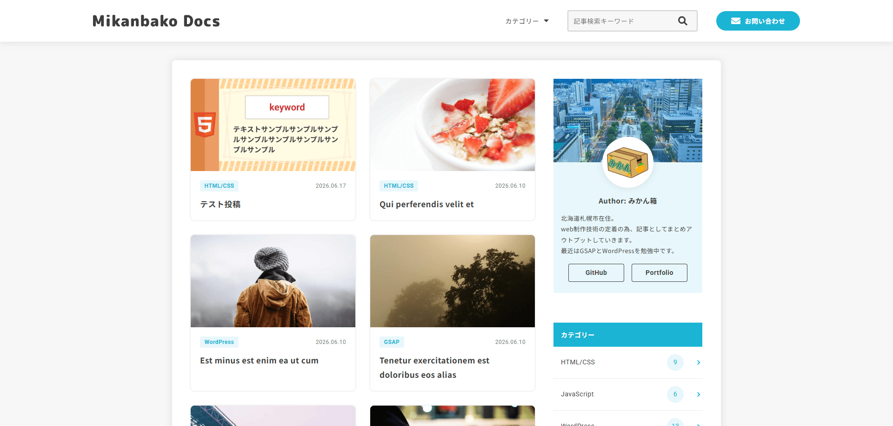

## 目次<!-- omit in toc -->
- [概要](#概要)
- [公開URL](#公開url)
- [目的](#目的)
- [こだわったポイント](#こだわったポイント)
- [使用技術](#使用技術)
- [使用フォント](#使用フォント)
- [デザインカンプ](#デザインカンプ)
- [各画面・機能紹介](#各画面機能紹介)
  - [トップページ](#トップページ)
    - [ヘッダー](#ヘッダー)
      - [（SP表示時）ハンバーガーメニュー](#sp表示時ハンバーガーメニュー)
    - [サイドバー](#サイドバー)
    - [フッター](#フッター)
  - [アーカイブページ](#アーカイブページ)
  - [検索結果ページ](#検索結果ページ)
  - [記事ページ](#記事ページ)
    - [目次自動作成機能](#目次自動作成機能)
      - [（PC表示時）サイドバー目次の追従機能](#pc表示時サイドバー目次の追従機能)
      - [（SP表示時）目次表示ボタン・目次モーダル機能](#sp表示時目次表示ボタン目次モーダル機能)
    - [関連記事表示機能](#関連記事表示機能)
    - [デモページ](#デモページ)
    - [記事本文](#記事本文)
      - [ブロックスタイルとFormat APIによる装飾機能の拡張](#ブロックスタイルとformat-apiによる装飾機能の拡張)
      - [ブロックエディタ（管理画面）へのスタイル自動反映](#ブロックエディタ管理画面へのスタイル自動反映)
  - [お問い合わせページ](#お問い合わせページ)
  - [サンクスページ](#サンクスページ)
  - [プライバシーポリシーページ](#プライバシーポリシーページ)
  - [404ページ](#404ページ)
- [WordPressプラグイン使用による実装](#wordpressプラグイン使用による実装)
  - [Category Order and Taxonomy Terms Order](#category-order-and-taxonomy-terms-order)
  - [SEO SIMPLE PACK](#seo-simple-pack)
  - [SiteGuard WP Plugin](#siteguard-wp-plugin)
  - [WP Mail SMTP](#wp-mail-smtp)
  - [Contact Form 7](#contact-form-7)
    - [デフォルト機能の無効化と独自スタイルの適用](#デフォルト機能の無効化と独自スタイルの適用)
    - [JavaScriptによる送信時処理の最適化（UX向上）](#javascriptによる送信時処理の最適化ux向上)

## 概要
「Mikanbako Docs」は、Web制作に関する技術情報（主にフロントエンド領域）を発信・記録するための技術ブログです。

WordPressをベースにフルスクラッチでオリジナルテーマを構築しており、記事の閲覧・カテゴリー検索・目次の自動生成からお問い合わせ機能まで、ブログメディアとして必要な基本機能を網羅しています。

## 公開URL
[https://docs.mikanbako.jp/](https://docs.mikanbako.jp/)

## 目的
本プロジェクトは、主に以下の2点を目的として制作いたしました。

**学習内容のアウトプットと知識の確実な定着**

日々学んだフロントエンド技術（HTML/CSS、JavaScript、GSAPなど）や、WordPressの知見を記事としてまとめ、自ら継続的に発信していくことで、自身の技術力と知識の定着を図る「実践的なアウトプットの場」として運用します。

**WordPressによる動的サイト構築スキルの証明（ポートフォリオ作品）**

WordPressを用いたオリジナルテーマの開発を通じて、PHPによる動的なページ生成の仕組みや、テンプレート階層の理解、各種プラグインとの連携を実践的に学ぶとともに、自身のフロントエンドおよびWordPress構築スキルを証明するポートフォリオ作品として機能させることを目的としています。

## こだわったポイント

**ユーザー体験（UX）を向上させる記事ページの動的機能**

技術ブログとしての利便性を高めるため、記事本文（`h2`〜`h4`）から自動生成される「目次（TOC）機能」を自作しました。PC表示時はサイドバーに追従し、スマートフォン・タブレット表示時は専用モーダルで開閉するレスポンシブな設計にしています。また、記事末尾の「関連記事」は、「同じタグ」を持つ記事をランダム取得し、指定件数（4件）に満たない場合は「同じカテゴリー」の記事で補完するという、独自のフォールバック処理をPHPで実装し、関連性の高い記事を途切れることなく提示できるように工夫しています。

**運用者目線に立ったGutenberg（ブロックエディタ）のカスタマイズ**

「記事の書きやすさ」も重要な要件と捉え、管理画面側のUI向上にもこだわりました。[`functions.php`](wp-content/themes/docs-theme/functions.php)での「段落（警告・ヒント等）」や「リスト」「テーブル」のカスタムブロックスタイルの登録に加え、WordPressのFormat APIを活用し([`editor.js`](wp-content/themes/docs-theme/assets/js/editor.js))、ツールバーに独自のインライン装飾（黄色マーカー、赤文字など）を追加しています。これにより、HTML/CSSの知識がない運用者でも、直感的かつ統一されたデザインで記事を執筆できる環境を構築しました。

**表示速度と可読性を最優先したUI設計**

「技術記事をサクッと閲覧できること」を最優先の目的とし、過度な装飾や不要なアニメーションを削ぎ落としたシンプルなデザインに統一しています。その上で、ユーザーの視線誘導が必要な部分（アンカーリンクでのスクロールや、目次表示などのUI操作）にのみGSAPを用いた滑らかなアニメーションを適応し、「速さ」と「心地よさ」の両立を図りました。

**外部ライブラリを安全に動作させる「デモページ」専用アーキテクチャ**

GSAPなどのJavaScriptライブラリを使用した複雑なデモ動作を記事内で安全に紹介するため、専用のカスタム投稿タイプ（`demo`）を作成しました。ヘッダーやフッターを排除した専用テンプレート（[`single-demo.php`](wp-content/themes/docs-theme/single-demo.php)）を用意し、カスタムHTMLブロックとカスタムフィールドを組み合わせることで、グローバルなサイト環境を汚染することなく、CodePenのように独立した環境でCDNライブラリを読み込み・実行できるセキュアな設計にしています。

**BEM設計とSCSSによる高い保守性の実現**

サイト全体のCSSは、FLOCSSベースのディレクトリ構造にて、BEMの命名規則に則り、SCSSを用いてコンポーネントごとに細かく分割して管理しています。モディファイアによる状態管理や、変数・mixinを活用した一元管理を徹底することで、デザイン変更や機能拡張にも柔軟に対応できる、破綻しにくいCSSアーキテクチャを実現しています。

## 使用技術
**フロントエンド**
* GSAP
* JavaScript
* Sass (SCSS)
* HTML

**バックエンド**
* WordPress
* PHP

**データベース**
* MySQL

**インフラ・その他**
* さくらVPS
* Apache (Webサーバー)
* Git / GitHub (バージョン管理・デプロイ)

## 使用フォント
* 和文フォント

  [Noto Sans JP](https://fonts.google.com/noto/specimen/Noto+Sans+JP)

* 欧文フォント

  [Roboto](https://fonts.google.com/specimen/Roboto)

## デザインカンプ
[Figmaページ](https://www.figma.com/design/b0P1DBetkNb2B8MXXm0zrc/blog?node-id=0-1&t=5WBI9eidphUCPWPs-1)（Figmaページへのリンクです。閲覧のみ可能です。）

※上記はベースとなったデザインカンプです。アニメーションの追加や細かなUI・レイアウトの調整は実装段階でコードを書きながらブラッシュアップを行ったため、現在の実際のサイトとは一部デザインが異なる箇所がございます。

## 各画面・機能紹介

本サイトの主要なページ構成と、各画面に実装している機能やこだわりポイントについて、実際の動き（webp動画）やスクリーンショットを交えながら紹介します。

### トップページ
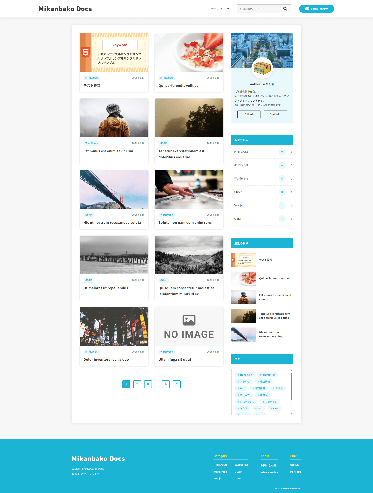

サイトの顔となるトップページ（フロントページ）です。

最新の記事一覧をシンプルなカード型のレイアウトで表示し、ユーザーが目的の記事に素早くアクセスできるようにしています。
下部にはWordPress標準のページネーション機能（`the_posts_pagination`）を組み込み、過去の記事へもスムーズに遷移できる回遊性の高い設計にしています。

>テンプレートファイル: [front-page.php](wp-content/themes/docs-theme/front-page.php)

#### ヘッダー

全ページ共通で上部に固定（追従）されるヘッダーです。

SEOとアクセシビリティの観点から、サイトロゴのHTMLタグを「トップページでは`<h1>`、それ以外のページでは`
`」となるようPHPで動的に切り替える処理を実装しています。
また、PC表示時の「カテゴリー」メニューは、ホバー時にCSSの`clip-path`プロパティを用いたアニメーションでドロップダウン表示されるよう実装し、JavaScriptに依存しない軽量で滑らかなUIを実現しています。

>テンプレートファイル: [header.php](wp-content/themes/docs-theme/header.php)

##### （SP表示時）ハンバーガーメニュー
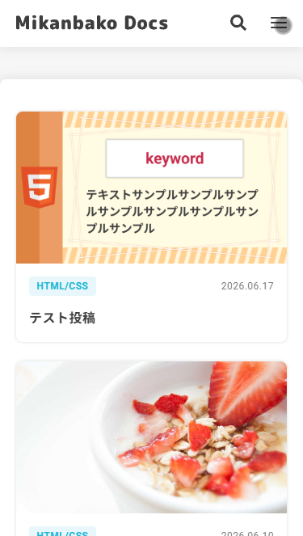

スマートフォンおよびタブレット表示時に機能する、スライドイン式のメニューです。
シンプルなUIでありながら、ユーザービリティの向上と予期せぬバグを防ぐため、JavaScriptを用いた細やかな制御を実装しています。

* **スクロール制御と操作性の向上**

  メニュー展開時は `document.body` に `overflow: "hidden"` を付与して背面コンテンツのスクロールを禁止し、誤操作を防いでいます。また、メニュー内のリンクをタップした際や、メニュー外の背景（オーバーレイ領域）をタップした際にも、自動的にメニューが閉じるようイベントリスナーを細かく設定しています。

* **モダンなCSSスタイリング**

  メニュー展開時の背景にはCSSの `backdrop-filter: blur(5px)` を用いてぼかし効果を適用し、背面のコンテンツとメニュー領域を視覚的に分離しています。

* **リサイズ時のフェイルセーフ設計**

  `window.matchMedia("(min-width: 1024px)")` を用いて画面幅のブレイクポイントをJS側でも監視しています。タブレットの回転操作などでSP表示からPC表示へと切り替わった瞬間に、もしSPメニューや検索フォームが開いたままであっても自動的にリセット（閉じる処理を実行）し、レイアウトの破綻を未然に防ぐ設計にしています。

>関連ファイル: [common.js](wp-content/themes/docs-theme/assets/js/src/common.js) / [_header.scss](wp-content/themes/docs-theme/assets/scss/layout/_header.scss) / [header.php](wp-content/themes/docs-theme/header.php)

#### サイドバー
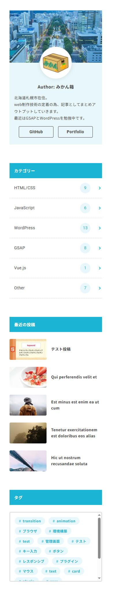

PC表示時に画面右側に配置されるサイドバーです。

運営者プロフィール、カテゴリー一覧（投稿数付き）、最新の投稿5件、タグ一覧などのウィジェットをコンポーネント化して配置しています。
特に「タグ」のエリアは、タグの数が増えてもレイアウトが崩れないようCSSで高さを制限（`max-height`）し、あえて要素を少し見切らせることで「スクロール可能であること」を直感的に伝えるアフォーダンスを意識したデザインにしています。

また、記事ページを表示した際のみ、サイドバーの最下部に「目次」が自動で追従出力されるようPHPで制御しています。

>テンプレートファイル: [sidebar.php](wp-content/themes/docs-theme/sidebar.php)

#### フッター

サイト全体の締めくくりとなるフッターです。

「カテゴリー」・「サイト案内（お問い合わせ等）」・「外部リンク」と、リンクの目的ごとにグループ（カラム）を分けて配置することで、ユーザーが迷わず情報にたどり着ける設計を意識しました。

>テンプレートファイル: [footer.php](wp-content/themes/docs-theme/footer.php)

### アーカイブページ
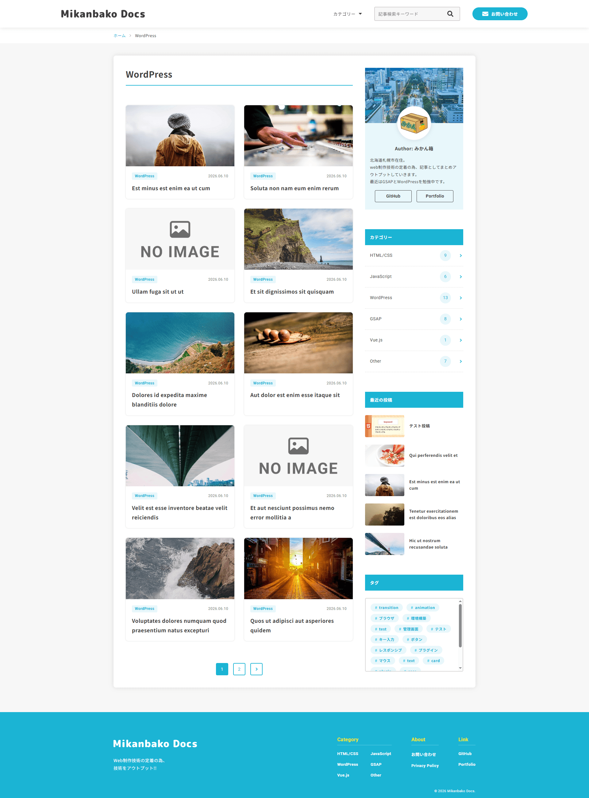

カテゴリーやタグなどで絞り込んだ記事一覧を表示するアーカイブページです。

基本レイアウトはトップページを踏襲し、記事カード（[`template-parts/card.php`](wp-content/themes/docs-theme/template-parts/card.php)）やページネーションのコンポーネントを再利用することで、サイト全体のUIの統一感を保ちつつ、保守性の高いコード設計にしています。

また、見出し部分（`.p-archive-header__title`）は、[`functions.php`](wp-content/themes/docs-theme/functions.php)にてフィルターフック（`get_the_archive_title`）を用いてカスタマイズしており、WordPress標準で出力されてしまう「カテゴリー: 」などの不要なプレフィックス文字列を削除することで、ユーザーにとってノイズのないスッキリとした画面表示になるよう微調整を加えています。

>テンプレートファイル: [archive.php](wp-content/themes/docs-theme/archive.php)

### 検索結果ページ
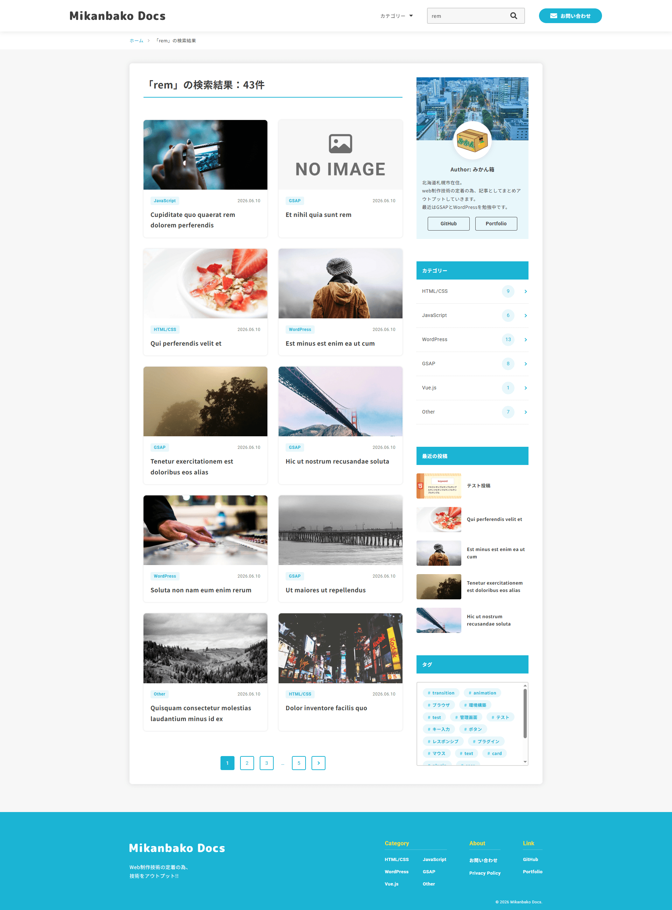

サイト内検索機能を利用した際に表示される検索結果ページです。

ユーザーが入力した「検索キーワード」と「ヒットした件数」を動的に見出し部分へ出力し、現在の検索状況をひと目で把握できる設計にしています。

* **空文字検索時のリダイレクト処理**

  [`functions.php`](wp-content/themes/docs-theme/functions.php)にて、検索キーワードが未入力（空文字）のまま検索ボタンが押された場合の制御を行っています。空文字検索を検知した際は、エラーを出さずに自動的にトップページへリダイレクト（`wp_safe_redirect`）させるフック処理を追加しており、ユーザーの予期せぬ混乱を防いでいます。

* **検索結果が0件だった場合の離脱防止（フォールバック）**

  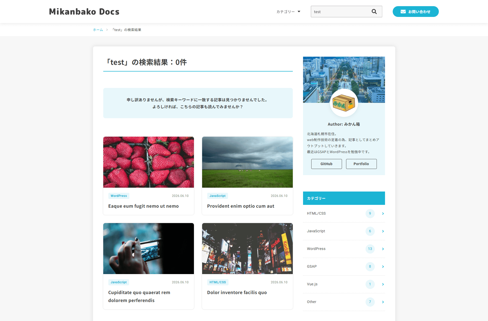

  検索結果が0件だった場合、専用のメッセージ（`.p-not-found`）を表示し、背景色や角丸を用いて視覚的に分かりやすくスタイリングしています。

  さらに、「よろしければ、こちらの記事も読んでみませんか？」という導線とともに、PHPのサブループ（`WP_Query`）を用いてランダムな記事を4件取得・表示させています。これにより、ユーザーがサイトから直帰してしまうことを防ぎ、別のコンテンツへの回遊を促すUX設計を取り入れています。

>関連ファイル: [search.php](wp-content/themes/docs-theme/search.php) / [functions.php](wp-content/themes/docs-theme/functions.php) / [_not-found.scss](wp-content/themes/docs-theme/assets/scss/object/project/_not-found.scss)

### 記事ページ
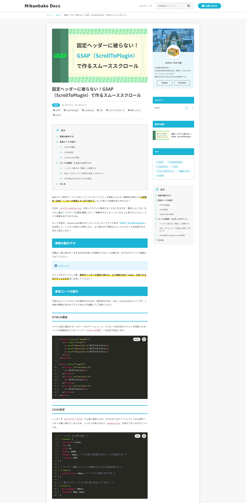

ブログのメインコンテンツとなる記事の詳細ページです。

アイキャッチ画像、タイトル、投稿日などのメタ情報、本文、そして前後の記事や関連記事へのナビゲーションなど、ユーザーが記事をスムーズに読み、次のアクションへ移れるようなレイアウトを構成しています。

>テンプレートファイル: [single.php](wp-content/themes/docs-theme/single.php)

#### 目次自動作成機能
プラグインを使用せず、PHPのフィルターフック（`the_content`）と正規表現（`preg_replace_callback`）を用いて、記事本文内の見出し（`h2`〜`h4`）から目次を自動生成する機能をフルスクラッチで実装しました。

見出しレベルに応じたインデントやナンバリングを動的に処理し、記事上部（デフォルト）、PC用サイドバー、SP用モーダルの3パターンのHTMLを効率的に出し分けられる関数（`get_article_toc`）を自作しています。

>関連ファイル: [toc.php](wp-content/themes/docs-theme/inc/toc.php) / [toc.js](wp-content/themes/docs-theme/assets/js/src/toc.js)

##### （PC表示時）サイドバー目次の追従機能
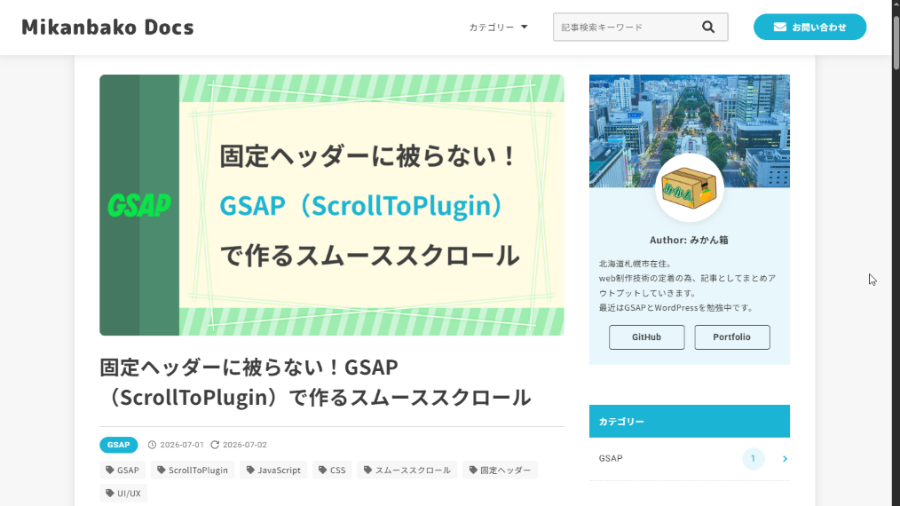

PC表示時は、サイドバーに配置した目次がCSSの `position: sticky` によって画面スクロールに追従します。

さらに、GSAPの `ScrollTrigger` を用いてユーザーの現在のスクロール位置（読んでいる見出し）を監視し、該当する目次アイテムに動的に `.is-active` クラスを付与するカレント表示機能を実装しています。

デザイン面では、サイドバー目次専用のスタイル（`.p-toc-sidebar`）を用意し、タイムラインのような縦線と丸（ドット）を用いて、現在地が視覚的にわかりやすくなるよう工夫しました。

>関連ファイル: [sidebar.php](wp-content/themes/docs-theme/sidebar.php) / [toc.php](wp-content/themes/docs-theme/inc/toc.php) / [toc.js](wp-content/themes/docs-theme/assets/js/src/toc.js)

##### （SP表示時）目次表示ボタン・目次モーダル機能
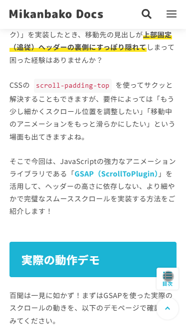

スマートフォン・タブレット表示時は、画面右下に固定配置された「目次ボタン」をタップすることで、目次がモーダルウィンドウとして全画面表示されます。

モーダルの開閉にはGSAPのタイムラインアニメーション（`gsap.timeline`）を使用し、心地よい操作感を実現しています。
また、ハンバーガーメニューと同様に、モーダル展開時は `document.body` のスクロールを禁止（`overflow: 'hidden'`）し、画面外のスクロール連動を防ぐためCSSに `overscroll-behavior: contain;` を指定するなど、モバイル端末での細やかなUX・アクセシビリティに配慮した設計を行っています。

>関連ファイル: [footer.php](wp-content/themes/docs-theme/footer.php) / [toc.php](wp-content/themes/docs-theme/inc/toc.php) / [toc.js](wp-content/themes/docs-theme/assets/js/src/toc.js)

#### 関連記事表示機能
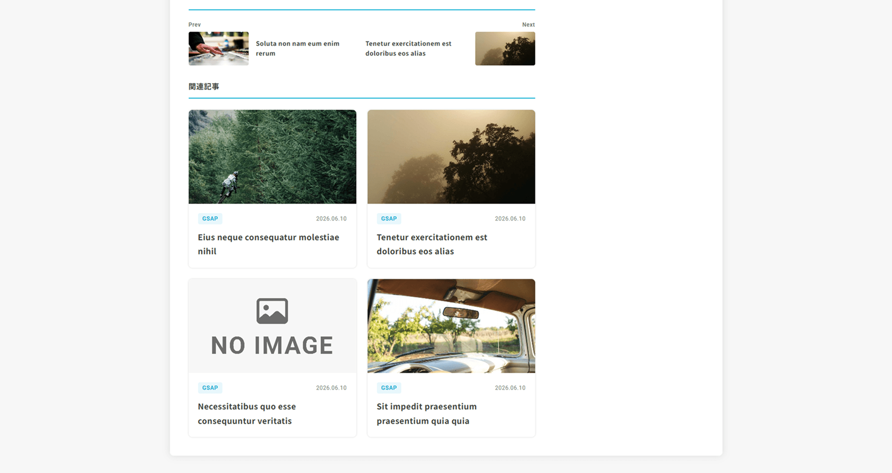

記事の末尾に、現在の記事と関連性の高いおすすめ記事を最大4件表示する機能を、プラグインに依存せずPHP（`WP_Query`）を用いてフルスクラッチで実装しています。

* **タグ優先とカテゴリーによるフォールバック処理**

  関連性をより高めるため、単に同じカテゴリーの記事を並べるのではなく、「まず同じタグを持つ記事を優先してランダムに取得」し、もしその数が最大表示件数（4件）に満たない場合は「足りない件数分だけ、同じカテゴリーの記事を追加取得して補完する」というロジックを組んでいます。

* **重複の排除**

  現在表示している記事自身や、タグ検索の段階ですでに取得した記事が、カテゴリー検索時に重複して表示されないよう、取得済みの記事IDを配列にストックしてクエリの除外条件（`post__not_in`）に渡す処理を実装しています。

* **カードコンポーネントの再利用**

  取得した記事の出力には、トップページやアーカイブページと共通の `template-parts/card.php` を呼び出して表示させており、デザインの統一感を保ちつつ、保守性・再利用性の高い設計にしています。

>関連ファイル: [single.php](wp-content/themes/docs-theme/single.php)

#### デモページ

GSAPなどのJavaScriptライブラリを用いたアニメーションやUIパーツの動作を、記事内で安全かつ独立して紹介するための専用デモページ（カスタム投稿タイプ `demo`）です。

* **干渉を防ぐ専用テンプレート（[`single-demo.php`](wp-content/themes/docs-theme/single-demo.php)）**

  グローバルなナビゲーション（ヘッダー・フッター）を意図的に排除し、`wp_head()` と `wp_footer()` のみを読み込むまっさらな専用テンプレートを用意しました。これにより、テーマ本体のレイアウトと干渉することなく、純粋なデモ動作のみを全画面で確認できる環境を構築しています。

* **カスタムフィールドを活用したセキュアなCDN読み込み**

  デモごとに必要な外部ライブラリ（GSAPなど）は、WordPressのカスタムフィールド（キー名：`demo_cdn`）を利用して読み込む設計にしています。エディタ画面のカスタムフィールドに入力した `<script src="...">` タグが、PHP側の `get_post_meta` を通じて `<head>` 内に直接出力される仕組みを構築しました。

* **Gutenberg（ブロックエディタ）との親和性**

  このアーキテクチャにより、最新仕様（ver7.0）のWordPressエディタ（カスタムHTMLブロック）の利便性を損なうことなく、HTML・CSS・JSを記述するだけで、独立したサンドボックス環境をサイト内に再現できるよう工夫しています。

>テンプレートファイル: [single-demo.php](wp-content/themes/docs-theme/single-demo.php)

#### 記事本文
技術ブログの核となる記事本文のエリア（`.p-content`）は、読者の可読性だけでなく、記事を執筆する「運用者側の使いやすさ」にもこだわって独自のカスタマイズを施しています。

見出しやリスト、引用（blockquote）といった基本のHTMLタグに対しては、サイトのテーマカラーを基調とした統一感のあるベーススタイルを[`_content.scss`](wp-content/themes/docs-theme/assets/scss/object/project/_content.scss)で定義しています。

>関連ファイル: [single.php](wp-content/themes/docs-theme/single.php) / [_content.scss](wp-content/themes/docs-theme/assets/scss/object/project/_content.scss)

##### ブロックスタイルとFormat APIによる装飾機能の拡張
Gutenberg（ブロックエディタ）の標準機能を拡張し、HTMLやCSSの専門知識がない運用者でも、直感的に記事を作成できるよう工夫しています。

* **カスタムブロックスタイルの登録**

  [`functions.php`](wp-content/themes/docs-theme/functions.php)にて、段落（警告・ヒントなどのボックス装飾）、リスト（チェックマークやステップ表示）、テーブルといった独自のブロックスタイルを多数登録しています。CSS側では、Sassのマップ機能（`@each`）を用いてカラーコードやSVGアイコンを一元管理し、コードの肥大化を防いでいます。

* **インライン装飾（Format API）**

  [`editor.js`](wp-content/themes/docs-theme/assets/js/editor.js)にてWordPressのFormat APIを活用し、ブロックエディタのツールバーに独自の文字装飾ボタン（黄色マーカー、赤文字、青文字、欧文フォント）を追加しました。ユーザーがテキストを選択してボタンを押すだけで、即座に専用のクラスが付与される仕組みです。

>関連ファイル: [editor.js](wp-content/themes/docs-theme/assets/js/editor.js) / [_block-styles.scss](wp-content/themes/docs-theme/assets/scss/object/project/_block-styles.scss)

##### ブロックエディタ（管理画面）へのスタイル自動反映
実際の公開画面と全く同じ見た目（WYSIWYG）で記事を執筆できるよう、エディタ画面の裏側にも最適化を行っています。

[`editor.js`](wp-content/themes/docs-theme/assets/js/editor.js)内で `wp.domReady` と `setInterval` を利用してエディタ領域の描画完了を監視し、エディタを囲む大枠の要素（`.editor-styles-wrapper`）に対して、フロント側と同じ `.p-content` クラスをJavaScript経由で自動付与する仕組みを構築しました。
これにより、テーマ専用のCSSが管理画面側にも適用され、執筆中のプレビューのズレをなくすことで運用者のストレスを軽減しています。

>関連ファイル: [editor.js](wp-content/themes/docs-theme/assets/js/editor.js)

### お問い合わせページ
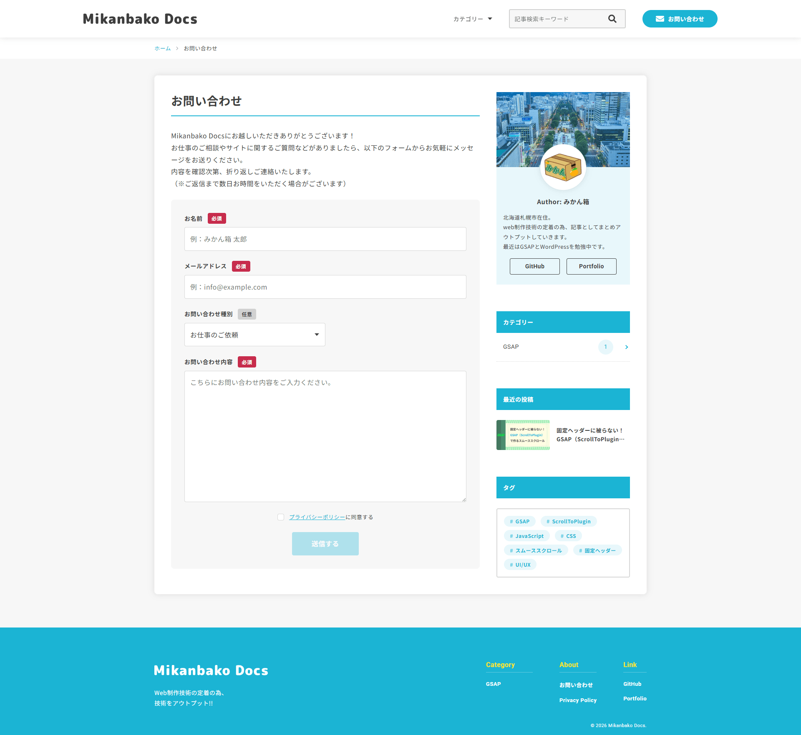

サイト訪問者からのご連絡を受け付けるためのコンタクトフォームです。

ユーザーが入力時に迷ったりストレスを感じたりしないよう、必要最低限の項目のみで構成し、シンプルなUIデザインにしています。

なお、フォームの送信処理（二重送信防止など）やサンクスページへの画面遷移といったシステム的な実装については、後述の「[Contact Form 7](#contact-form-7)」の項目にて詳しく解説します。

>テンプレートファイル: [page.php](wp-content/themes/docs-theme/page.php)

>関連ファイル: [_contact-form.scss](wp-content/themes/docs-theme/assets/scss/object/project/_contact-form.scss)

### サンクスページ
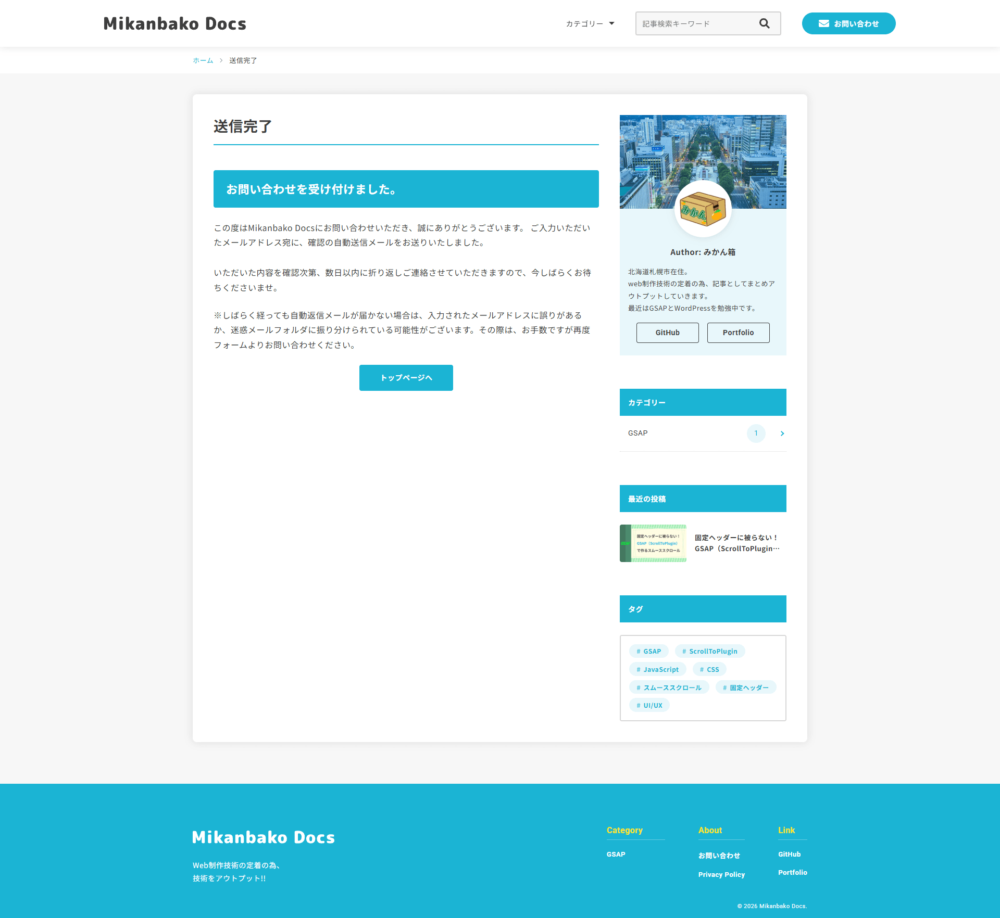

お問い合わせフォームの送信が正常に完了した後に遷移する、専用のサンクスページです。

送信完了のメッセージや自動返信メールに関するご案内を明確に表示してユーザーに安心感を与えつつ、HOME（トップページ）へ戻るためのリンクを配置しています。これにより、ユーザーが送信後もサイト内で迷わず、スムーズに回遊を続けられるようUXに配慮しています。

>テンプレートファイル: [page.php](wp-content/themes/docs-theme/page.php)

### プライバシーポリシーページ
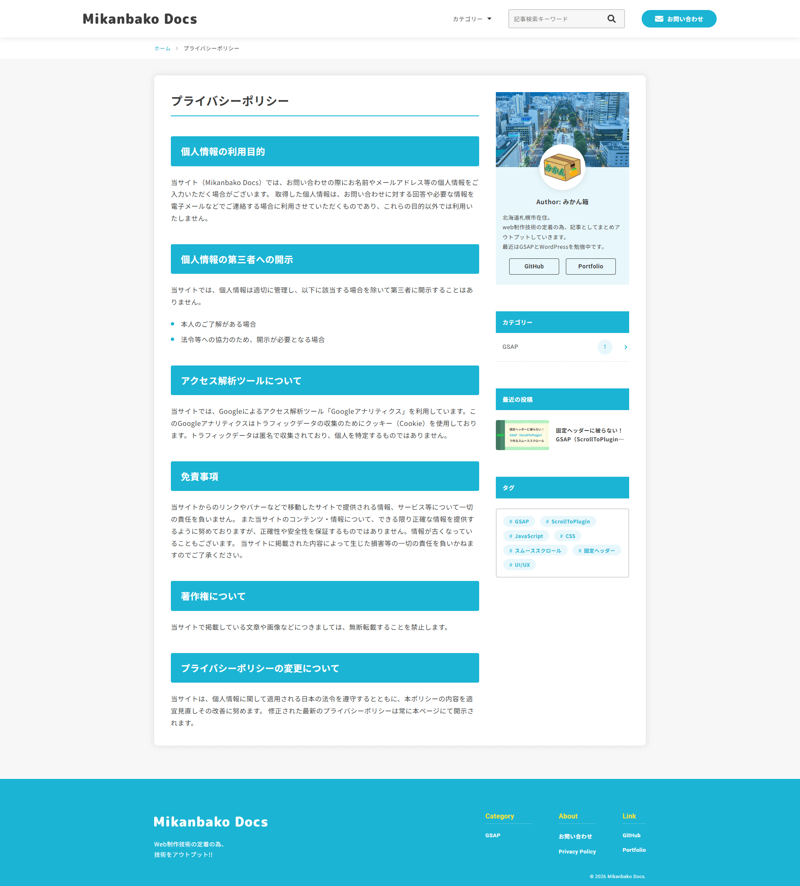

サイトを安全かつ適切に運用するためのプライバシーポリシー（個人情報保護方針）を記載した固定ページです。

お問い合わせフォームの送信前にユーザーから同意（チェックボックス）を得るための必須要件として設置しており、法令遵守（コンプライアンス）とサイト運営における信頼性担保の役割を果たしています。

>テンプレートファイル: [page.php](wp-content/themes/docs-theme/page.php)

### 404ページ
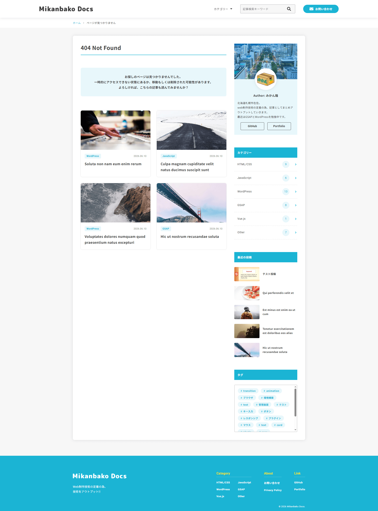

アクセスしたURLが存在しない場合に表示される、404 Not Foundページです。

検索結果が0件だった際と同様のUXとして、単にエラーを伝えるだけでなく「一時的にアクセスできない状態にあるか、移動もしくは削除された可能性があります」という具体的な可能性を明記し、ユーザーの不安を払拭しています。

さらに、PHPのサブループを用いてランダムな記事を4件自動で提案（フォールバック）することで、サイトからの直帰（離脱）を防ぎ、別のコンテンツへの回遊を促す工夫を施しています。

>テンプレートファイル: [404.php](wp-content/themes/docs-theme/404.php)

## WordPressプラグイン使用による実装
本サイトはフルスクラッチでオリジナルテーマを開発していますが、運用保守性やセキュリティ、SEO対策といった機能に関しては、車輪の再発明を避け、信頼性の高いプラグインを選定して導入しています。

### Category Order and Taxonomy Terms Order
WordPress標準では制御が難しい「カテゴリーの表示順序」を直感的に管理するために導入しました。

ヘッダーのドロップダウンメニューやサイドバーのカテゴリー一覧など、ユーザーがサイトを回遊する上で重要なナビゲーションの並び順を、意図した通り（重要度順など）に制御しています。

### SEO SIMPLE PACK
サイトの基本的なSEO対策とSNSシェア時の最適化を目的として導入しました。

各ページ個別の `<title>` やメタディスクリプションの設定に加え、OGP画像を管理し、検索エンジンとユーザー双方へのアピールを強化しています。必要最低限の設定が可能且つ軽量なため、サイトの表示速度を損なわない点も採用の理由です。

### SiteGuard WP Plugin
WordPressサイトのセキュリティを強固にするためのプラグインです。

主に以下の対策を実施し、不正アクセスやブルートフォース攻撃からサイトを保護しています。

* **ログインURLの変更**

  デフォルトのログイン画面（`wp-login.php`）のURLを独自のものに変更し、第三者のアクセスを遮断しています。

* **画像認証（CAPTCHA）**

  ログイン画面にひらがなの画像認証を追加し、機械的な不正ログインを防止しています。

* **フェールワンス**

  正しいログイン情報を入力しても、1回目は必ずログインを失敗させる機能で、リスト型攻撃の成功率を大幅に低下させています。

### WP Mail SMTP
お問い合わせフォームからのメール送信を確実に行うために導入しました。

WordPress標準のメール送信機能（PHPの `mail()` 関数）はスパム判定されやすいため、GmailのSMTPサーバーを経由するよう設定を変更しています。これにより、ユーザーへの自動返信メールや管理者への通知メールが確実に受信トレイへ届く、信頼性の高いメール運用環境を構築しています。

### Contact Form 7
お問い合わせフォームの実装には、プラグイン「Contact Form 7」を採用しています。

プラグイン標準の機能やスタイルに依存するのではなく、フロントエンドエンジニアの視点からUX向上とデザインの統一を図るため、独自のカスタマイズを施しています。

#### デフォルト機能の無効化と独自スタイルの適用
プラグインが自動出力する不要な `
` タグや ` ` タグ、およびデフォルトのCSSファイルは、サイトのレイアウト崩れやパフォーマンス低下の原因となるため、[`functions.php`](wp-content/themes/docs-theme/functions.php)にてフック（`wpcf7_autop_or_not`、`wpcf7_load_css`）を用いて読み込みを完全に無効化しています。

その上で、専用のSCSSファイル（[`_contact-form.scss`](wp-content/themes/docs-theme/assets/scss/object/project/_contact-form.scss)）を作成し、サイト全体のトンマナに合わせたデザイン（フォーカス時のエフェクト、カスタムチェックボックス、送信中スピナーのアニメーションなど）をBEM設計に基づいて当て直しています。

>関連ファイル: [functions.php](wp-content/themes/docs-theme/functions.php) / [_contact-form.scss](wp-content/themes/docs-theme/assets/scss/object/project/_contact-form.scss)

#### JavaScriptによる送信時処理の最適化（UX向上）
フォームの送信時における予期せぬエラーを防ぎ、ユーザーに安心感を与えるため、CF7が発行するカスタムDOMイベント（`wpcf7mailsent` 等）をフックしたJavaScript処理（[`contact.js`](wp-content/themes/docs-theme/assets/js/src/contact.js)）を自作しています。

* **二重送信（連打）防止機能**

  送信ボタン（`submit`）が押下された瞬間にボタンを `disabled` 状態にし、二重送信を防ぎます。入力エラー等で送信に失敗したイベント（`wpcf7invalid` 等）を検知した場合は、即座に `disabled` を解除して再入力を可能にしています。

* **サンクスページへの自動リダイレクト**

  メールの送信成功イベント（`wpcf7mailsent`）を検知した後、[`functions.php`](wp-content/themes/docs-theme/functions.php) の `wp_localize_script` を経由して安全に渡されたURL（サンクスページ）へ、JavaScriptで自動的にリダイレクトさせる処理を実装しています。

>関連ファイル: [contact.js](wp-content/themes/docs-theme/assets/js/src/contact.js)